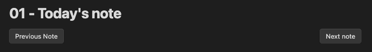

# Auto Journal

The core [Daily notes](https://help.obsidian.md/Plugins/Daily+notes) plugin for [Obsidian](https://obsidian.md/) doesn't backfill notes for the days when Obsidian wasn't opened. This plugin does.

It uses an opinionated folder structure that isn't configurable:

-   **Daily Notes**: `ROOT / YEAR / MONTH / DAY -`
-   **Monthly Notes**: `ROOT / YEAR / {custom-name} / MONTH -`

You can customize the date format of `YEAR`, `MONTH`, `DAY`, or set/remove the `ROOT`, but this plugin depends on organizing the filesystem by `YEAR`/`MONTH`/`DAY`.

The base of the filename in each folder should not be changed, e.g. `DAY -` for Daily Notes or `MONTH -` for Monthly Notes.

For instance, by default Daily Notes will be created like so,

`Journal/2023/August/11 -`

You can add whatever you'd like after the title,

`Journal/2023/August/11 - Work, Dog Park, Climb with Friends & Grab Dinner`

But make sure not to change the day part of the title, `11 -`

## Backfilling

When enabled, backfilling will create notes for previous days of the month/year when you didn't open the plugin.

For Daily Notes:

-   `For year` backfill will create a folder for each month before today and a note with the day prefix, e.g. `11 -` for each day of the month before today
-   `For month` backfill will create a note with the day prefix, e.g. `11 -` for each day of the month before today

For Monthly Notes:

-   `For year` backfill will a note each month before today month prefix, e.g. `January -` for each month of the year before this month

## Templating

You can include a configurable token (default `{{auto-journal-date}}`) in a template to be replaced by the date that the file would have been created in a backfill rather than the date it was actually created on.

By default, all variables from the [core Templates](https://help.obsidian.md/Plugins/Templates) plugin are supported using the settings from the core Templates plugin for date formatting e.g. `{{title}}`, `{{date}}`, `{{time}}`

However, `{{date}}` and `{{time}}` will use the day that you opened Obsidian and Auto Journal ran to create note files on, rather than the date that a backfilled note would have if it was created on the date it represents. 

## Commands

Opening today's daily/monthly note or the next/previous from today or the next/previous from the current note can be done via the command prompt with the following `Auto Journal: ` commands.

-   `Open today's daily note`
-   `Open next daily note`
-   `Open previous daily note`
-   `Open today's monthly note`
-   `Open next monthly note`
-   `Open previous monthly note`

You can assign hotkeys to any of these commands in the native Obsidian `Settings` -> `Hotkeys` tab.

## Navigation buttons

You can add buttons to navigate to today/next/previous daily/monthly notes via a `auto-journal-navigation` code block.

Inside the codeblock include the `type` of the button and the button text you want it to display.

To add previous and next buttons for daily notes, you can add the following code block:

````
```auto-journal-navigation
previous-daily: Previous Note
next-daily: Next note
\```
````

and they'd look something like this,



The following button `type`s are supported:

-   `today-daily`
-   `previous-daily`
-   `next-daily`
-   `today-monthly`
-   `previous-monthly`
-   `next-monthly`

You can add CSS to the following classes to change the styling and/or positions of the buttons,

-   `auto-journal-navigation-container` for the containing `<div>`
-   `auto-journal-navigation-button` for all the `<button>`s
-   `auto-journal-daily` for all the `daily` type buttons
-   `auto-journal-monthly` for all the `monthly` type buttons
-   `auto-journal-today` for all the `today` type buttons
-   `auto-journal-next` for all the `next` type buttons
-   `auto-journal-previous` for all the `previous` type buttons

Or you can adjust the CSS of a specific button using the button's `id` which is the same as its type. For instance a `next-daily` button has the id that can be accessed in CSS via `#next-daily`

## Plugins that pair well for daily journaling

-   [Custom File Explorer sorting](https://github.com/SebastianMC/obsidian-custom-sort) Since the default names of each journal are the full names of the months e.g. `January` the following `sortspec` file placed in the root folder of your journal will organize them in the correct order on your filesystem.

    -   <details>
        <summary>
        Click to see sortspec
        </summary>

        ```
        ---
        sorting-spec: |
         target-folder: /*
         README
         Check-Ins
         January...
         February...
         March...
         April...
         May...
         June...
         July...
         August...
         September...
         October...
         November...
         December...
         ...
         < a-z
         assets
        ---
        ```

        </details>

-   [Templater](https://github.com/SilentVoid13/Templater): Useful for inserting dates and other properties into your journal entry template.

    -   **Required:** You must enable the _"Trigger Templater on new file creation"_ setting for templater to work with Auto Journal
    -   <details>
        <summary>
        Click to see journal template
        </summary>

        ```
        ---
        date: <$date-from-auto-journal$>
        tag: journal
        ---

        # <% moment(tp.frontmatter.date).format("dddd, MMMM DD, YYYY") %> 📆

        ## People 👤
        -

        ## Grateful For 💙


        ## Photos 📸

        ```

        The frontmatter date set via Auto Journal token can be consumed by Templater in other functions, e.g. `<% moment(tp.frontmatter.date).format("dddd, MMMM DD, YYYY") %>`

        </details>

-   [Reminder](https://github.com/uphy/obsidian-reminder) Can include a reminder combined with Templater to be notified when a monthly check-in is due to be filled out.

    -   <details>
        <summary>
        Click to see check-in template
        </summary>

        ```
        ---
        date: <$date-from-auto-journal$>
        tag: check-in
        ---
        # **<% moment(tp.frontmatter.date).format("MMMM, YYYY") %>  Check In** 📆

        - [ ] Fill out Check In  📆 <% moment(tp.frontmatter.date).format("YYYY-MM-DD") %>

        ### 1. How are you? How was this month?


        ### 2. What did you prioritize this month?


        ### 3. Where do you see yourself in 1, 3, & 5 years? Has your long term vision changed?


        ### 4. Are your habits and goals aligned with this current vision? If so what needs to be changed to meet them?


        ### 5. Is there anything missing from your life?


        ### 6. Take back to reflect on the month. What progress did you make? What are you grateful for?


        ### 7. What are looking forward to in the next month?
        ```

        The above example uses the Tasks Plugin date format which must be set in Reminder's settings.

        </details>

-   [@ Symbol Linking](https://github.com/Ebonsignori/obsidian-at-symbol-linking) I keep a `People` directory at the top of my journal that I regularly link to with the `@` symbol. You can configure this plugin to only look for links in that directory when typing `@`.

-   [Google Photos](https://github.com/alangrainger/obsidian-google-photos) Useful way to include photos in each of your entries while storing them in a separate app. This plugin will create thumbnails so you can still see the photos, but they'll be hosted by Google and not take up space in your vault.

## Installing

The preferred method is adding this through the [built-in community plugin browser](https://help.obsidian.md/Extending+Obsidian/Community+plugins) in Obsidian.

### Manual installation

1. Create a new folder in your vault, `.obsidian/plugins/auto-journal`
1. Download and move the files from the latest release in the [Releases Page](https://github.com/Ebonsignori/obsidian-auto-journal/releases) to the new folder, `.obsidian/plugins/obsidian-auto-journal`
1. In Obsidian go to `Settings -> Community Plugins`
1. Enable community plugins if they aren't already enabled, then and enable the checkbox for `Auto Journal`

## Contributing

Please [open an issue](https://github.com/Ebonsignori/obsidian-auto-journal/issues/new) with any suggestions or bug reports.

See [contributing docs](docs/contributing.md) if you'd like to open a PR.

## Acknowledgements

[The Obsidian team](https://obsidian.md/about) for creating a wonderful product :purple_heart:

The implementation borrows from:

-   [suggest.ts](./src/utils/suggest.ts) and the [file-suggest.ts](./src/settings/file-suggest.ts) and [folder-suggest.ts](./src/settings/folder-suggest.ts) that implement it are copyrighted works of [Liam Cain](https://github.com/liamcain), [obsidian-periodic-notes](https://github.com/liamcain/obsidian-periodic-notes).
